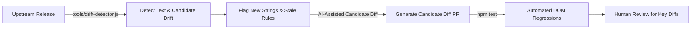

# Google Antigravity Chinese Localization Toolkit

<p align="center">
  <a href="README.md">简体中文</a> | <a href="README.en.md">English</a>
</p>

A high-performance, non-invasive Chinese localization patch and lifecycle manager designed for **Google Antigravity 2.0** desktop clients (Windows, macOS, and Linux).

---

## 🌟 Key Features & Engineering Design

- **Non-invasive Runtime Engine**: Injects a responsive DOM translation engine at Electron's `preload` phase without modifying official core binaries.
- **Preload Synchronization (Minimizing FOUC)**: Early mount during the renderer initialization phase to minimize English-to-Chinese visual flicker.
- **Protected Code & Terminal**: Intelligently ignores code editing areas (`Monaco Editor`, `pre`, `code`) and terminal consoles (`xterm`), preserving user code and terminal commands.
- **Self-Healing & File Watcher**: Built-in self-healing launcher (`launch.bat`) and file watcher to automatically detect upstream update overrides.
- **Multi-Sentence Compound Parsing**: Seamlessly breaks down multi-sentence paragraphs and translates cascading dynamic time/quota values.
- **Automated Backup & Reversible Restore**: Automatically creates `app.asar.bak` on initial installation and restores official English status with one click.

---

## 📋 Prerequisites

Before installing the patch, make sure your environment meets the following requirements:

1. **Supported Operating Systems**:
   - **Windows**: Windows 10 / 11 (x64)
   - **macOS**: macOS 12+ (Apple Silicon M-series & Intel chips; automated `codesign` ad-hoc signing included)
   - **Linux**: Major distributions (Ubuntu, Debian, Fedora, Arch, etc., x64/ARM64)
2. **Node.js Runtime Environment**:
   - **Node.js (>= 16.x)** with `npx` / `npm` (required for unpacking and repacking the ASAR package).
   - Run `node -v` and `npx -v` in your terminal to verify. If not installed, download the LTS release from [Node.js Official Website](https://nodejs.org/).
3. **Google Antigravity Installed**:
   - Official **Google Antigravity 2.0** desktop client installed.
4. **⚠️ Critical Notice (Prevent File Lock Errors)**:
   - **Completely quit the Antigravity client before installing, updating, or restoring the patch** (right-click the system tray icon and select "Quit"). Otherwise, the OS will lock `app.asar`, causing `EPERM / EBUSY` errors.

---

## 🚀 Quick Start

### Method 1: Scripts (Recommended)

#### Windows
- **Install Patch**: Double-click [`install.bat`](file:///C:/Projects/antigravity-chinese/install.bat)
- **Self-Healing Launch**: Double-click [`launch.bat`](file:///C:/Projects/antigravity-chinese/launch.bat)
- **Restore English**: Double-click [`uninstall.bat`](file:///C:/Projects/antigravity-chinese/uninstall.bat)

#### macOS / Linux
- **Install Patch**: Run `./install.sh`
- **Restore English**: Run `./uninstall.sh`

---

### Method 2: CLI Manager

```bash
# Check client status
node cli.js status

# Install localization patch
node cli.js install

# Launch with automatic healing
node cli.js launch

# Background daemon watcher
node cli.js watch

# Restore official English version
node cli.js restore
```

---

## 🧪 Testing & Verification

This project uses comprehensive automated regression test suites and cross-platform CI to ensure stability:

```bash
# Run complete test suite
npm test
```

- **Core Injection Tests (`test/verify.js`)**: Uses JSDOM to simulate actual DOM rendering and verify 34+ assertion checkpoints.
- **Screenshot Regressions (`test/test-screenshots.js`)**: Covers 54+ real UI test cases.
- **Title Collision Protection (`test/test-menu-and-titles.js`)**: Prevents single-word substring collisions from corrupting user-generated session titles.
- **Cross-platform CI**: Automated GitHub Actions testing across Windows, macOS, and Ubuntu.

---

## 🔄 Self-Evolving Localization Architecture

Rather than relying entirely on manual screenshot gathering, the project is incrementally building an automated evolution pipeline:



- **Three-Tier Coverage Metrics**: Run `npm run scan:drift` to report Observed Candidates, Exact Match Coverage, and Rule-Assisted Effective Translation Coverage.
- **Stale Rule Discovery**: Bi-directionally analyzes `exactKeys - observed` to surface dictionary entries that might have been deprecated or refactored upstream.
- **Progressively Reduced Maintenance Cost**: Transitions repetitive manual verification to automated difference extraction and regression suites, leaving only key terminology decisions to human maintainers.

## 🔌 Dual-Mode Ecosystem: Official Antigravity Plugin Suite

In addition to running as a client host UI localization patch, this project ships with an **official Antigravity Agent Plugin** located in [`plugins/chinese-toolkit/`](file:///C:/Projects/antigravity-chinese/plugins/chinese-toolkit/):

### Plugin Capabilities
- **Chinese Interaction & Engineering Rules (`rules/chinese-interaction-rules.md`)**: Enforces end-to-end Simplified Chinese thinking/replies, Chinese code commenting, and strict preservation of technical terms/brand names.
- **Localization Diagnostics Skill (`skills/i18n-diagnostics/`)**: Equips the agent with built-in status diagnostics, upstream drift analysis (`scan:drift`), and automated testing workflows.

### How to Enable the Plugin
- **Global Installation (Recommended)**: Copy or symlink `plugins/chinese-toolkit` to your global plugin directory:
  - Windows: `%USERPROFILE%\.gemini\config\plugins\chinese-toolkit`
  - macOS / Linux: `~/.gemini/config/plugins/chinese-toolkit`
- **Workspace-level**: Place `chinese-toolkit` inside `.agents/plugins/` in any project root to share with your team.

---

## 📁 Repository Structure

```text
antigravity-chinese/
├── dict/
│   └── zh-CN.json            # Localization dictionary (1040+ exact entries + regex cascade)
├── core/
│   └── i18n-runtime.js       # Runtime engine (Preload hook, debounce, Monaco protection)
├── plugins/
│   └── chinese-toolkit/      # Official Antigravity plugin (Rules + Diagnostics Skill)
├── cli.js                    # Cross-platform CLI manager
├── install.bat / install.sh  # One-click installation scripts
├── launch.bat                # Self-healing launcher script
├── uninstall.bat / uninstall.sh # One-click restore scripts
├── test/                     # Automated E2E test suites (JSDOM, screenshot regressions)
├── tools/                    # Text extraction, drift detection, and gap analysis tools
├── docs/assets/sponsoring/   # Donation and sponsorship assets
├── package.json              # Project configuration
├── LICENSE                   # MIT License
└── README.md                 # Documentation
```

---

## 💖 Sponsoring & Donation

If this project helps your daily workflow and you would like to support continuous maintenance, documentation, and automated tests, voluntary donations of any amount are deeply appreciated.

- **PayPal**: [PayPal Payment Link](https://www.paypal.com/ncp/payment/LNTF8KXGJXMZY)
- **WeChat Pay / Alipay (RMB)**: See QR codes below.

<table>
  <tr>
    <td align="center"><strong>WeChat Pay (CNY)</strong><br></td>
    <td align="center"><strong>Alipay (CNY)</strong><br></td>
  </tr>
</table>

---

## ⚠️ Disclaimer & Compliance

1. **Non-official Project**: This is an open-source community localization tool and is **NOT an official Google product**. It is not affiliated with or endorsed by Google LLC.
2. **Trademarks**: `Google`, `Google Antigravity`, `Gemini`, `Chrome`, and related trademarks belong to their respective owners.
3. **Legal Use**: This project **does not distribute** proprietary binaries (such as `app.asar` or decompiled sources). All modifications occur locally on the user's client.
4. **Privacy & Security**: Contains **zero telemetry, zero backdoors, and zero external credential collection**. 100% open-source and transparent.

---

## 📄 License

Distributed under the [MIT License](LICENSE).
