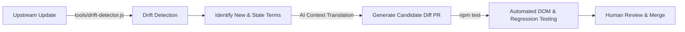

# Google Antigravity Chinese Localization Toolkit

<p align="center">
  <a href="https://github.com/yiheng8023/antigravity-chinese/actions/workflows/ci.yml"></a>
  <a href="https://github.com/yiheng8023/antigravity-chinese/releases/latest"></a>
  <a href="https://github.com/yiheng8023/antigravity-chinese/releases"></a>
  <a href="https://github.com/yiheng8023/antigravity-chinese/stargazers"></a>
  <a href="https://github.com/yiheng8023/antigravity-chinese/network/members"></a>
  
  
  <a href="LICENSE"></a>
</p>

<p align="center">
  <a href="README.md">简体中文</a> | <a href="README.en.md">English</a>
</p>

A high-performance, reversible Chinese localization patch and lifecycle manager designed for **Google Antigravity 2.0** desktop clients (Windows, macOS, and Linux), currently at version **v3.2.39**.

---

## 🌟 Key Features & Engineering Design

- **Reversible Runtime Engine**: Injects a responsive DOM translation engine at Electron's `preload` phase, balancing lightweight execution with deep localization.
- **High-Performance Low-Overhead Runtime Architecture**: Eliminates uncontrolled `requestIdleCallback` spinning loops; introduces DOM negative-tag caching with `O(1)` instantaneous short-circuiting on unhit nodes; floating Portal filters and a 100ms throttle valve keep intensive streaming dialogues and virtual scrolling smooth and responsive.
- **Preload Synchronization Hook (Minimizing FOUC)**: Mounts early during renderer initialization to minimize English-to-Chinese visual flicker.
- **Protected Code & Terminal**: Intelligently ignores code editing areas (`Monaco Editor`, `pre`, `code`) and terminal consoles (`xterm`), strictly preserving user code and terminal commands.
- **Self-Healing & File Watcher**: Built-in self-healing launcher (`launch.bat`) and file watcher to automatically detect and reapply patches after upstream updates.
- **Multi-Sentence Compound Parsing & Cascading Regexes**: Seamlessly breaks down complex multi-sentence paragraphs, with support for cascading dynamic regex replacements for timestamps and quotas (over **1,780+ exact entries** and **166 cascading dynamic regex rules**).
- **DOM Dynamic Interpolation & Semantic Self-Healing**: Resolves upstream split node fragments and relative clause inverted word order (e.g. Security Preset floating Tooltips and Local Permissions clauses) with full-sentence closed-loop recovery.
- **Two-Phase Staged Swap & Cold-Boot Crash Recovery**: Employs safe staged file swap with auto-rollback. If sudden power-offs leave an orphaned swap file, the CLI entrance automatically detects and restores `app.asar` on next startup, preventing client binary loss.
- **Dual-State Baseline & Anti-Downgrade Circuit Breaker**: Automatically creates a pristine `app.asar.bak` baseline on initial installation and updates the baseline upon silent upstream updates; enforces circuit breakers during `restore` to prevent stale backups from overwriting newer official releases.
- **Graceful Yield to Upstream Chinese**: Built-in CJK character and native locale probes to automatically yield when official upstream Chinese lands.

---

## 📋 Prerequisites

Before installing the patch, make sure your environment meets the following requirements:

1. **Supported Operating Systems**:
   - **Windows**: Windows 10 / 11 (x64)
   - **macOS**: macOS 12+ (Apple Silicon M-series & Intel chips; automated `codesign` ad-hoc signing included)
   - **Linux**: Major distributions (Ubuntu, Debian, Fedora, Arch, etc., x64 / ARM64)
2. **Node.js Runtime Environment**:
   - **Node.js (>= 18.x)** with `npm` and `npx` (Fully compatible with Node 18/20/22/24+ LTS releases).
   - Run `node -v` and `npx -v` in your terminal to verify. If not installed, download the LTS release from [Node.js Official Website](https://nodejs.org/).
3. **Google Antigravity Installed**:
   - Official **Google Antigravity 2.0** desktop client installed.
4. **Automated Process Lock & Guard**:
   - Built-in cross-platform process guard automatically detects and safely releases client file locks during installation and restoration.

---

## 🚀 Quick Start

### Method 1: Scripts (Recommended for Daily Use)

#### Windows
- **Install Patch**: Double-click [`install.bat`](install.bat) (Runs pre-flight health check, safely releases file locks, and installs UI patch + community agent plugin)
- **Self-Healing Launch**: Double-click [`launch.bat`](launch.bat) (Auto-detects upstream updates, re-patches, and launches)
- **Restore English**: Double-click [`uninstall.bat`](uninstall.bat)

#### macOS / Linux
- **Install Patch**: Run `./install.sh`
- **Restore English**: Run `./uninstall.sh`

---

### Method 2: CLI Command Line Manager

```bash
# 1. Check current client and localization status
node cli.js status

# 2. Run comprehensive pre-flight health checks (Node version, NPX tools, ASAR path, file locks)
node cli.js check

# 3. One-click install (auto-backup and injection)
node cli.js install

# 4. Install Antigravity Chinese Agent Community Plugin
node cli.js install-plugin

# 5. Self-healing launch (auto-detects upstream updates, re-patches, and launches client)
node cli.js launch

# 6. Background watcher daemon mode (listens for upstream updates and auto-patches)
node cli.js watch

# 7. One-click restore to official English version
node cli.js restore

# 8. Specify custom installation path
node cli.js install --path "/path/to/antigravity/resources/app.asar"
```

---

## 🧪 Automated Testing & CI Verification

The project includes an end-to-end regression test suite and cross-platform CI matrix (Windows / macOS / Ubuntu x Node 18/20) covering **149+ assertions**:

```bash
# Run all automated test suites (aggregating 6 full-fidelity test suites, 149+ assertions)
npm test
```

- **DOM Translation & Performance Short-Circuiting (`test/verify.js`)**: Uses JSDOM to verify 81 assertions covering critical DOM paths, Monaco Editor & terminal protection, zero-lag DOM negative-tag caching with O(1) short-circuiting, and floating Portal gate thresholds.
- **Screenshot Fixture Assertions (`test/test-screenshots.js`)**: Covers 88 test cases from real UI screenshots with compound sentences and dynamic quota values.
- **Menu, Tray & Suicide Prevention Gate (`test/test-menu-and-titles.js`)**: 22 assertions ensuring single-character words do not corrupt custom session titles, main process system tray integration and native dialog safety, and suicide prevention gates in agent environments (preventing process termination).
- **ASAR Lifecycle & Upgrade Idempotence (`test/test-asar-lifecycle.js`)**: Builds real ASAR binary packages to test extraction, injection, double-install idempotence, upstream upgrade simulation, and atomic restoration (18 assertions, including Stage 3 regression testing for silent upstream updates preventing downgrade on restore).
- **Live Path Detector (`test/test-detector-live.js`)**: Validates 0-argument system path detection on real Ubuntu / macOS / Windows runners.
- **Proofreading & Terminology Integrity (`test/test-proofread-integrity.js`)**: 11 assertions ensuring zero typos, full-width punctuation, standard CCF terminology, and safe regex compilation.

---

## 🔄 Self-Evolving Pipeline (Roadmap)

Facing frequent Antigravity updates, the core evolution direction is building a closed loop that automatically tracks upstream changes:



- **Three-Tier Metrics**: `npm run scan:drift` outputs total observed candidates, exact match coverage, and rule-assisted coverage.
- **Stale Rule Detection**: Identifies historical entries in the dictionary that are no longer observed upstream (`exactKeys - observed`), providing cleanup leads.
- **Reduced Maintenance Cost**: Replaces manual verification with automated diff extraction and regression testing.

---

## 🔌 Dual-Mode Architecture: Community Plugin Suite

In addition to the host UI localization patch, this project includes a complete **Chinese Agent Enhancement Plugin** compliant with Antigravity specifications (Plugin ID: `antigravity-chinese-toolkit`, located in [`plugins/chinese-toolkit/`](plugins/chinese-toolkit/)):

### Plugin Features
- **Interaction & Engineering Rules (`rules/chinese-interaction-rules.md`)**: Configures agents for complete Simplified Chinese thinking, comments, and terminology preservation.
- **I18n Diagnostics Skill (`skills/i18n-diagnostics/`)**: Equips agents with one-click health diagnosis, drift analysis (`scan:drift`), and test execution capabilities.

### Enabling the Plugin
- **One-click Global Install (Recommended)**: Run `node cli.js install-plugin` (or automatically via `install.bat`)
- **Manual Installation**: Copy `plugins/chinese-toolkit` to your global plugin directory:
  - Windows: `%USERPROFILE%\.gemini\config\plugins\chinese-toolkit`
  - macOS / Linux: `~/.gemini/config/plugins/chinese-toolkit`
  - *Note: Antigravity identifies the plugin by the `name` field in `plugin.json` (`antigravity-chinese-toolkit`), while the directory can be `chinese-toolkit`.*

---

## 📁 Repository Structure

```text
antigravity-chinese/
├── .github/
│   └── workflows/
│       └── ci.yml                    # Cross-platform CI automated test workflow (Ubuntu/macOS/Windows)
├── dict/
│   └── zh-CN.json                    # Core translation dictionary (1,730+ exact entries + 166 dynamic regexes)
├── core/
│   └── i18n-runtime.js               # Zero-lag preload runtime injection engine (DOM negative tags & gates)
├── plugins/
│   └── chinese-toolkit/              # Antigravity official Chinese agent community plugin
│       ├── rules/                    # Agent Chinese interaction rules (chinese-interaction-rules.md)
│       ├── skills/                   # Localization diagnostic skills (i18n-diagnostics)
│       └── plugin.json               # Antigravity plugin manifest specification
├── test/                             # Automated full-fidelity regression test suites (149+ assertions)
│   ├── verify.js                     # JSDOM DOM simulation and code area protection assertions
│   ├── test-screenshots.js          # Real UI screenshot compound sentences & state machine assertions
│   ├── test-menu-and-titles.js       # Menu items, tray integration, and custom title protection assertions
│   ├── test-asar-lifecycle.js        # 18 ASAR lifecycle, double-install idempotence & anti-downgrade assertions
│   ├── test-detector-live.js         # Real host system 0-argument path detection assertions
│   └── test-proofread-integrity.js   # Publication-grade typos, punctuation, terminology & regex safety checks
├── tools/                            # Upstream reverse engineering, diff analysis & drift detection toolchain
│   ├── drift-detector.js             # Upstream version text & candidate drift detector (npm run scan:drift)
│   ├── build-full-dict.js            # Full dictionary automated builder and deduplication tool
│   └── gap-analysis.js               # Translation coverage gap & missed item automated analyzer
├── docs/assets/sponsoring/           # Sponsorship & community assets
├── cli.js                            # Cross-platform lifecycle CLI (detect, backup, extract, inject, pack, restore)
├── install.bat / install.sh          # One-click installation scripts (installs UI patch + community plugin)
├── launch.bat                        # Self-healing launcher (second-level drift check and launch)
├── uninstall.bat / uninstall.sh      # One-click restore scripts (safe anti-downgrade rollback)
├── package.json                      # Project configuration & npm scripts
├── LICENSE                           # MIT License
└── README.md / README.en.md          # Bilingual documentation
```

---

## 💖 Voluntary Sponsoring & Support

If the Antigravity Chinese Localization Toolkit has benefited your work and daily development, and you would like to support ongoing maintenance, documentation improvements, automated testing, and version updates, voluntary donations of any amount are deeply appreciated. Sponsorship is entirely voluntary and does not constitute any service-level agreement.

- **RMB Sponsorship**: Scan the WeChat Pay or Alipay QR codes below.
- **Cross-Border / Other Currencies**: Use our **[PayPal Sponsoring Link](https://www.paypal.com/ncp/payment/LNTF8KXGJXMZY)**. Accepted currencies, payment methods, and exchange rates are subject to PayPal's checkout page.

Please verify the payee name shown on the checkout page before confirming payment. Thank you for your support of open-source software!

<table>
  <tr>
    <td align="center"><strong>WeChat Pay (RMB)</strong><br></td>
    <td align="center"><strong>Alipay (RMB)</strong><br></td>
  </tr>
</table>

---

## 👥 Contributors

Heartfelt thanks to all developers who contribute code, report bugs, and improve translations and documentation!

<p align="center">
  <a href="https://github.com/yiheng8023/antigravity-chinese/graphs/contributors">
    
  </a>
</p>

---

## 📈 Star History & Community Growth

[](https://star-history.com/#yiheng8023/antigravity-chinese&Date)

---

## ⚠️ Disclaimer & Compliance

1. **Non-Official Project**: This project is an independent open-source localization utility developed by the open-source community. It is **NOT** an official product of Google LLC and is neither affiliated with nor endorsed by Google LLC or its subsidiaries.
2. **Trademark Notice**: `Google`, `Google Antigravity`, `Gemini`, `Chrome`, and related trademarks, product names, and copyrights are the property of their respective owners.
3. **Authorized Personal Use**: This toolkit is provided solely for personal learning, technical research, and Chinese localization assistance. This project **DOES NOT** distribute any proprietary binary assets (such as official `app.asar` packages or source files); all patching operations are executed locally on the user's client machine.
4. **Security & Privacy**: This project contains **ZERO** telemetry reporting, network backdoors, or credential extraction mechanisms. All source code is 100% transparent and auditable.

---

## 📄 License

This project is licensed under the [MIT License](LICENSE).
