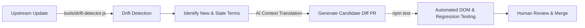

# Google Antigravity Chinese Localization Toolkit

<p align="center">
  <a href="https://github.com/yiheng8023/antigravity-chinese/actions/workflows/ci.yml"></a>
  <a href="https://github.com/yiheng8023/antigravity-chinese/releases/latest"></a>
  
  
  <a href="LICENSE"></a>
</p>

<p align="center">
  <a href="README.md">简体中文</a> | <a href="README.en.md">English</a>
</p>

A high-performance, reversible Chinese localization patch and lifecycle manager designed for **Google Antigravity 2.0** desktop clients (Windows, macOS, and Linux).

---

## 🌟 Key Features & Engineering Design

- **Reversible Runtime Engine**: Injects a responsive DOM translation engine at Electron's `preload` phase, balancing lightweight execution with deep localization.
- **Preload Synchronization (Minimizing FOUC)**: Early mount during renderer initialization to minimize English-to-Chinese visual flicker.
- **Protected Code & Terminal**: Intelligently ignores code editing areas (`Monaco Editor`, `pre`, `code`) and terminal consoles (`xterm`), preserving user code and terminal commands.
- **Self-Healing & File Watcher**: Built-in self-healing launcher (`launch.bat`) and file watcher to automatically detect and reapply patches after upstream updates.
- **Multi-Sentence Compound Parsing**: Seamlessly breaks down multi-sentence paragraphs and translates cascading dynamic time/quota values.
- **Versioned Fingerprint Baseline & Reversible Restore**: Automatically creates pristine `app.asar.bak` baseline on initial installation and updates baseline on upstream updates; restores official English status with one click.
- **Graceful Yield to Upstream Chinese**: Built-in CJK character and native locale probes to automatically yield when official upstream Chinese lands.

---

## 📋 Prerequisites

Before installing the patch, make sure your environment meets the following requirements:

1. **Supported Operating Systems**:
   - **Windows**: Windows 10 / 11 (x64)
   - **macOS**: macOS 12+ (Apple Silicon M-series & Intel chips; automated `codesign` ad-hoc signing included)
   - **Linux**: Major distributions (Ubuntu, Debian, Fedora, Arch, etc., x64/ARM64)
2. **Node.js Runtime Environment**:
   - **Node.js (>= 16.x)** with `npm` / `npx` (Fully compatible with Node 18/20/22/24+).
   - Run `node -v` and `npx -v` in your terminal to verify. If not installed, download the LTS release from [Node.js Official Website](https://nodejs.org/).
3. **Google Antigravity Installed**:
   - Official **Google Antigravity 2.0** desktop client installed.
4. **Automated Process Lock & Guard**:
   - Built-in cross-platform process guard automatically detects and safely releases client file locks during installation and restoration.

---

## 🚀 Quick Start

### Method 1: Scripts (Recommended)

#### Windows
- **Install Patch**: Double-click [`install.bat`](install.bat) (Runs pre-flight check, safely releases file locks, and installs UI patch + community agent plugin)
- **Self-Healing Launch**: Double-click [`launch.bat`](launch.bat)
- **Restore English**: Double-click [`uninstall.bat`](uninstall.bat)

#### macOS / Linux
- **Install Patch**: Run `./install.sh`
- **Restore English**: Run `./uninstall.sh`

---

### Method 2: CLI Command Line Manager

```bash
# 1. Check current client and localization status
node cli.js status

# 2. Run comprehensive pre-flight health checks (Node version, NPX tools, ASAR path, file locks)
node cli.js check

# 3. One-click install (auto-backup and injection)
node cli.js install

# 4. Install Antigravity Chinese Agent Community Plugin
node cli.js install-plugin

# 5. Self-healing launch (auto-detects upstream updates, re-patches, and launches client)
node cli.js launch

# 6. Background watcher daemon mode (listens for upstream updates and auto-patches)
node cli.js watch

# 7. One-click restore to official English version
node cli.js restore

# 8. Specify custom installation path
node cli.js install --path "/path/to/antigravity/resources/app.asar"
```

---

## 🧪 Automated Testing & CI Verification

The project includes an end-to-end regression test suite and cross-platform CI matrix (Windows / macOS / Ubuntu x Node 18/20) covering 145+ assertions:

```bash
# Run all automated test suites
npm test
```

- **DOM Translation & Code Protection (`test/verify.js`)**: Uses JSDOM to verify 50 key DOM paths, Monaco Editor protection, and cross-platform path resolution.
- **Screenshot Fixture Assertions (`test/test-screenshots.js`)**: Covers 64 test cases from real UI screenshots with compound sentences and dynamic quota values.
- **Menu & Session Title Safety (`test/test-menu-and-titles.js`)**: Ensures single-character words do not corrupt custom user session titles.
- **ASAR Lifecycle & Upgrade Idempotence (`test/test-asar-lifecycle.js`)**: Builds real ASAR binary packages to test extraction, injection, double-install idempotence, upstream upgrade simulation, and atomic restoration.
- **Live Path Detector (`test/test-detector-live.js`)**: Validates 0-argument system path detection on real Ubuntu / macOS / Windows runners.
- **Proofreading & Terminology Integrity (`test/test-proofread-integrity.js`)**: 11 assertions ensuring full-width punctuation, standard terminology, and safe regex compilation.

---

## 🔄 Self-Evolving Pipeline (Roadmap)



---

## 🔌 Dual-Mode Architecture: Community Plugin Suite

In addition to the host UI localization patch, this project includes a complete **Chinese Agent Enhancement Plugin** compliant with Antigravity specifications (located in [`plugins/chinese-toolkit/`](plugins/chinese-toolkit/)):

### Plugin Features
- **Interaction & Engineering Rules (`rules/chinese-interaction-rules.md`)**: Configures agents for complete Simplified Chinese thinking, comments, and terminology preservation.
- **I18n Diagnostics Skill (`skills/i18n-diagnostics/`)**: Equips agents with one-click health diagnosis, drift analysis (`scan:drift`), and test execution capabilities.

### Enabling the Plugin
- **One-click Global Install (Recommended)**: Run `node cli.js install-plugin`
- **Manual Installation**: Copy `plugins/chinese-toolkit` to your global plugin directory:
  - Windows: `%USERPROFILE%\.gemini\config\plugins\chinese-toolkit`
  - macOS / Linux: `~/.gemini/config/plugins/chinese-toolkit`

---

## 📁 Repository Structure

```text
antigravity-chinese/
├── dict/
│   └── zh-CN.json            # Translation dictionary (1070+ keys + 25 regex patterns)
├── core/
│   └── i18n-runtime.js       # Preload runtime injection engine
├── plugins/
│   └── chinese-toolkit/      # Community Agent Plugin (Rules + Diagnostic Skills)
├── cli.js                    # Cross-platform CLI lifecycle manager
├── install.bat / install.sh  # One-click installation scripts
├── launch.bat                # Self-healing launcher
├── uninstall.bat / uninstall.sh # One-click restore scripts
├── package.json              # Project configuration & npm scripts
├── LICENSE                   # MIT License
├── README.md                 # Simplified Chinese Documentation
└── README.en.md              # English Documentation
```

---

## 📄 License

This project is licensed under the [MIT License](LICENSE).
