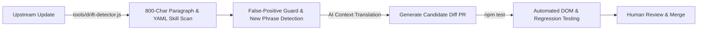

# Google Antigravity Universal Chinese Suite (Antigravity Chinese Universal Suite)

<p align="center">
  <a href="https://github.com/yiheng8023/antigravity-chinese/actions/workflows/ci.yml"></a>
  <a href="https://github.com/yiheng8023/antigravity-chinese/releases/latest"></a>
  <a href="https://github.com/yiheng8023/antigravity-chinese/releases"></a>
  <a href="https://github.com/yiheng8023/antigravity-chinese/stargazers"></a>
  <a href="https://github.com/yiheng8023/antigravity-chinese/network/members"></a>
  
  
  <a href="LICENSE"></a>
</p>

<p align="center">
  <a href="README.md">简体中文</a> | <a href="README.en.md">English</a>
</p>

A high-performance, reversible Chinese localization suite and lifecycle manager designed for the entire **Google Antigravity** ecosystem (Desktop App 2.0, Standalone IDE & IDE Extensions, CLI), currently at version **v3.3.16** (fully adapted for Antigravity **v2.19.1**).

---

### 🌐 Ecosystem Support Matrix

| Surface (Ecosystem) | Architecture & Role | Localization Mechanism | Support Status |
| :--- | :--- | :--- | :---: |
| 🖥️ **Desktop App (Antigravity 2.0)** | Standalone Electron app with boards, chat canvas & Aux Pane | ASAR physical injection / CDP zero-disk mount + IPC native menu interception | 🟢 **100% Production Ready** |
| 🧩 **IDE Extensions (VS Code Extension)** | Embedded editor assistant, commands, settings panel & sidebar chat | `package.json` mapping + Webview micro reverse proxy deep injection | 🟢 **100% Production Ready** |
| 💻 **Standalone IDE (Antigravity IDE)** | AI-first IDE built on Code-OSS / VS Code | Official Chinese language pack support + core engine alignment | 🟡 **Architectural Alignment** |
| ⚡ **Terminal CLI (`agy`)** | Geek terminal interaction & workflow scripting | Adhering to hacker engineering principles: preserving native English & Google digital signature integrity, preventing TUI grid displacement & pipeline incompatibilities | 🛡️ **Native Preservation / Zero-Interference** |
| 🔌 **Plugins & Skills (`SKILL.md`)** | 10 official catalog plugins & 131 built-in skills/agents | Dual-source YAML & JSDoc publication-grade localization | 🟢 **100% Production Ready** |

> [!NOTE] **Decoupled Architecture & Elastic Probing Guarantee**:
> The toolkit adheres strictly to the principle of "physical isolation and elastic probing". If only the Desktop App or VS Code is installed locally, the installer will target only available components and gracefully skip uninstalled surfaces (such as the standalone IDE or JetBrains) with zero side-effects or errors.

---

## 🌟 Key Features & Engineering Design

- 🧩 **VS Code Extension Full Localization & Webview Deep Injection (VS Code Extension Full Localization & Webview Proxy)**:
  - **Unified One-Click Suite Installation**: Whether double-clicking [`install.bat`](install.bat) or running `node cli.js install`, the installer performs automatic multi-surface probing and synchronizes full localization across Desktop App, official agent plugins, and the VS Code extension without requiring separate scripts.
  - **Conquering Webview iframe Language Islands**: To solve the challenge of `Antigravity Settings` and the sidebar chat panel being rendered by a background Language Server Webview iframe without Electron preload script access, an ultra-lightweight local reverse proxy (`agy-i18n-proxy.js`) is injected in-memory with `i18n-bundle.js`, making settings and chat views 100% native Chinese.
  - **100% Publication-Grade Localization for Commands, Settings & Editors**: Translates all 10 command palette entries (`Add Selection to Chat` ➔ `将选中文本添加到对话`, `Accept All Changes` ➔ `接受所有更改`, `Open Antigravity Settings` ➔ `打开 Antigravity 设置`, etc.), all 9 configuration descriptions (server port, inline diff CodeLens, telemetry, auto-accept pending edits, etc.), and custom artifact/settings viewers.
  - **Bidirectional Atomic Rollback & Dual Pristine Backups**: Automatically creates pristine `package.json.bak` and `extension.js.bak` backups, equipped with dedicated one-click scripts [`install-vscode.bat`](install-vscode.bat) / `npm run install:vscode` and [`restore-vscode.bat`](restore-vscode.bat) / `npm run restore:vscode`. Repeated installations will never pollute backups, guaranteeing instant lossless recovery.

- 🖱️ **Native Context Menu & Cascading Submenu Interception (Native Context Menu & Cascading Submenu Interception)**:
  - **OS-Level Native Context Menu IPC Interception**: Left-hand conversation history items (`Rename`, `Mark Unread`, `Copy`, `Split`, `Archive`, `Delete`) and input context menus (`Cut`, `Copy`, `Paste`, `Select All`) are natively spawned by the Electron main process via `Menu.buildFromTemplate` and unreachable by renderer DOM `MutationObserver`. We inject dictionary mapping interceptors directly into the main-process IPC dispatcher (`ipcHandlers.js`) for 100% native context menu localization.
  - **Multi-Level Cascading Submenu Coverage & Dynamic Dictionary Fusion**: Full topological coverage for `Copy` submenus (`Conversation Name` ➔ `会话名称`, `Conversation ID` ➔ `会话 ID`, `Project Name` ➔ `项目名称`, `Copy Relative Path` ➔ `复制相对路径`, etc.) and `Split` submenus (`Split Right` ➔ `向右拆分`, `Split Down` ➔ `向下拆分`, `Replace With New` ➔ `替换为新会话`), dynamically fusing all high-frequency dictionary tags under 40 characters to eliminate every native menu blindspot.
  - **Radix / Popper Floating Tooltip Topological Adaptation**: Re-architected floating element fast-path gates in `core/i18n-runtime.js` to deeply support high-z-index containers (`.animate-slideIn`, `[data-side]`, `[data-align]`, and `z-[7000]`), triggering instantaneous translation on `pointerdown` and `contextmenu` to eliminate lingering English tooltips (`Copy` ➔ `复制`).
  - **Shortcut Subtitles & Dynamic Sentences**: Complete localization for keyboard shortcuts sub-headers (`Keyboard shortcuts for quick navigation and control.`) and dynamic user email feedback sentences (`Send feedback as ...`).

- 🚀 **Antigravity v2.19.1 Full Adaptation & New Features Localization**:
  - **Built-in Skill Extensions**: Publication-grade localization for 2.19.1 new built-in skills: `ui-extension` (Build, package, run, and debug UI extensions for interactive side-pane web panels) and `ui-plugin-navigation` (Discover UI plugin panels and surface one-click pill buttons).
  - **Aux Pane Goals Panel**: Native support for the brand new first-class `Goals` tab in the Aux Pane, seamlessly aligned with subagents, background tasks, artifacts, and modified files.
  - **Dynamic Execution Time Regex Group**: Introduced cascading regex patterns for agent runtime states: `Worked for ...` (worked for $1 s/m/h/d) and `Stopped after ...` (stopped after $1).
  - **Artifact & Document PDF Export**: Full support for new artifact action bar tools: `Export as PDF`, `Failed to print document:`, and `Download SVG`.
  - **Global Command Search & Indexing Alerts**: Updated palette placeholders (`Search tabs, files, plugins, subagents, artifacts, tasks...`, `Search file contents...`) and ongoing indexing notices.
  - **Notification Preferences & System Permissions**: Covered new notification preference dialogs (`Notification Preferences` & `Allow Gemini to notify you...`).
  - **Conversation Forking & Charting Guardrails**: Localized `Fork warning`, missing fork destination errors, and Mermaid empty pie chart exceptions.
  - **Channel Badges**: Supported titlebar and header release channel badges for `Insiders` and `Autopush`.

- 📝 **Selection Quote Toolbar Localization**:
  - Accurately captures floating action bars upon highlighting message text, resolving boundaries for isolated command keywords and shortcuts into canonical `引用 Ctrl+L`.
  - Multi-tier dictionary sources (`dict/src/`) and compilation pipelines fully aligned against regression.

- 🎯 **Model Selector Pure English Design & React DOM Reconciliation Guard**:
  - Adheres to the principle of "Technical model specs stay native English, peripheral operations stay Chinese": All model identifiers, technical tiers, and status badges within the model selector panel (`Low`, `Medium`, `High`, `Fast`, `Limited`, `Limited time`, `(Thinking)`, etc.) **remain 100% authentic native English**, preventing cognitive clutter caused by unnecessary translation.
  - Completely blocks React virtual DOM text node append conflicts (eradicating the "中高" compound concatenation glitch upon model switching), establishing boundary-level isolation for Trigger buttons and model items.
  - Preserves polished Chinese localization for peripheral menu controls, including panel header (`Model` ➔ `模型`) and usage details link (`View Usage` ➔ `查看用量明细`).

- ⚡ **Dual-Mode Synergy Architecture**:
  - **Mode 1 (Deep ASAR Physical Injection)**: Deeply patches the ASAR archive for 100% native localization covering system tray (`tray.js`), menus (`menu.js`), and UI DOM.
  - **Mode 2 (Zero-Dependency CDP Hot-Mount)**: Custom-built 150-line native Node.js RFC 6455 protocol client; zero disk modifications, completely immune to upstream silent updates.
- 🐧 **WSL Cross-Platform Synergy**:
  - Deeply supports Windows clients connecting to WSL (Ubuntu, etc.) Linux environments.
  - Natively translates application menus `Connect to WSL` and `Reopen Locally`.
  - Injects translations for main-process dialogs, including missing WSL distros and cross-filesystem `/mnt` performance warnings.
- 🧩 **2.18.1 Full Feature Coverage, Inline DOM Reordering & 10 Plugins + 131 Skills**:
  - Complete localization for **2.18.1** modules: Trajectory Debug View (`Open Trajectory Debug View`), declared subagent permissions review modal (`declared-permissions-modal`), plugin OAuth authentication & customization token budget warnings, per-conversation telemetry toggles, enterprise billing model picker (`Select billing model`), built-in browser, and the full PDF Viewer toolbar.
  - Surgical healing for JSX composite alerts (e.g. `plan-command-fyi-alert`) and inline DOM sentence reordering (e.g. `Also includes <span>Global Permissions</span> when working in this project.` ➔ `在此项目中工作时，也包含全局权限。`), restructuring split text nodes into natural Chinese word order while preserving inline element event listeners.
  - Complete localization for baseline/model quota banners (`Baseline model quota reached`), AI Credits & Overages alerts (`Insufficient AI Credits`), and error notification cards, including multi-sentence splitting and full-width punctuation normalization after inline `<a>` links.
  - Comprehensive publication-grade translations for the 10 official plugins in `Build with Antigravity Plugins` (Android CLI, Chrome DevTools, Data Agent Kit, Dart and Flutter, Firebase, Gemini API, Google Maps Platform, Modern Web Guidance, Google Antigravity SDK, Science) and all **local & built-in `SKILL.md` / `agents` / `rules` descriptions** (including multi-line YAML `>-` / `|` block scalars).
- 🛡️ **Zero False-Positive Engine & Full-Sentence Conservation**:
  - Abolishes blind substring replacement (`phraseKeys`) and upgrades multi-sentence splitting to strict `allTranslated` conservation, eliminating half-English/half-Chinese hybrids and inflated coverage illusions.
  - Enforces `Object.prototype.hasOwnProperty` prototype guards (protecting against `toString` / `constructor` collisions) and strict hotkey parenthesis matching (preventing spaced descriptive parentheses from being misclassified as keyboard shortcuts).
- 🏗️ **Three-Tier Dictionary Compiler & Security Gates**:
  - Modularized source layout: `dict/src/core/` (atomic pure terms), `dict/src/rules/` (cascading regexes), `dict/src/ctx/` (context-scoped entries: `permissions.json`, `settings.json`, `plugins.json`).
  - Built-in **ASCII Key Barrier** (guards against Chinese intermediate key fragments), **Capture-Group Invariant Guard** (syntax compilation and `$1..$N` conservation), and **Duplicate Key Conflict Guard**, producing a unified `dist/zh-CN.bundle.json` with seamless backward compatibility.
- 🎯 **Single-Source Truth & Golden Snapshots**:
  - Core runtime extracts a stateless calculation factory `createI18nEngine` eliminating shadow duplicates across test suites and drift tools.
  - 227 comprehensive UI test cases verified via strict `assert.strictEqual` golden assertions, paired with 5 invariant fuzzing suites (11-entry model spec zero-translation assertion, thinking durations, reset countdowns, model interpolations, punctuation tolerances).
- ⚡ **Ultra-High Performance Runtime Architecture**:
  - Replaces deep recursive `closest` and cross-subtree `querySelector` traversals with **pure single-node attribute $O(1)$ short-circuit guards**, reducing element inspection latency from 0.5~2ms to 0.0005ms (over 1,000x faster).
  - Eliminates bubbling `mouseover` event storms and redundant click listeners by adopting lightweight, pure non-bubbling `pointerenter` with 120ms throttling and 50ms debounced floating container scans, eliminating Tailwind `z-[` container false positives and eradicating frame drops during rapid scrolling and mouse movements.
  - Prevents erratic 50~60Hz `requestIdleCallback` spin loops and maintains negative DOM cache tags for $O(1)$ instant bypass of non-translatable text nodes.
- **Option Floating Tooltips & Delivery Strategies Coverage**: Fully covers dynamic floating tooltips across Settings (e.g. Queued Messages options: `Queue until after the current turn.` ➔ `排队等待，直至当前轮次结束。`, `Interrupt the agent and send immediately.` ➔ `打断智能体并立即发送。`), terminal auto-execution policies, artifact review policies, and Strict Mode descriptions.
- **Multi-TextNode Coalescing Self-Healing**: Resolves upstream React split-node fragmentations (e.g. `"All ", e, "s run as Flash."` split into sibling TextNodes causing plural suffix leftovers) with atomic full-sentence coalescence while strictly preserving virtual DOM node topology and reference integrity.
- **Protected Code & Terminal**: Intelligently ignores code editing areas (`Monaco Editor`, `pre`, `code`) and terminal consoles (`xterm`), strictly preserving user code and terminal commands.
- **Two-Phase Staged Swap, In-Session Staged Auto-Apply & Cold-Boot Crash Recovery**: Supports non-destructive pre-building (`app.asar.staged`) inside active Antigravity agent sessions with a detached background watcher that atomically swaps the archive within 0.3s of client exit; automatically detects and recovers orphaned swap files on cold boot.
- **Dual-State Baseline & Anti-Downgrade Circuit Breaker**: Automatically creates a pristine `app.asar.bak` baseline on initial installation and updates the baseline upon silent upstream updates; enforces circuit breakers during `restore` to prevent stale backups from overwriting newer official releases.
- **Graceful Yield to Upstream Chinese**: Built-in CJK character and native locale probes to automatically yield when official upstream Chinese lands.

---

## 📋 Prerequisites

Before installing the patch, make sure your environment meets the following requirements:

1. **Supported Operating Systems**:
   - **Windows**: Windows 10 / 11 (x64)
   - **macOS**: macOS 12+ (Apple Silicon M-series & Intel chips; automated `codesign` ad-hoc signing included)
   - **Linux**: Major distributions (Ubuntu, Debian, Fedora, Arch, etc., x64 / ARM64)
2. **Node.js Runtime Environment**:
   - **Node.js (>= 18.x)** with `npm` and `npx` (Fully compatible with Node 18/20/22/24+ LTS releases).
   - Run `node -v` and `npx -v` in your terminal to verify. If not installed, download the LTS release from [Node.js Official Website](https://nodejs.org/).
3. **Antigravity Ecosystem Components Installed**:
   - Ensure the official **Google Antigravity 2.0** desktop client or the **VS Code Official Extension** (`google.google-antigravity`) is installed. The installer adheres to elastic probing, automatically identifying installed components and injecting patches accurately while quietly skipping uninstalled environments.
4. **Automated Process Lock & Guard**:
   - Built-in cross-platform process guard automatically detects and safely releases client file locks during installation and restoration.

---

## 🚀 Quick Start

### Method 1: Scripts (Recommended for Daily Use)

#### Windows
- **Full Ecosystem All-in-One Installation (Recommended)**: Double-click [`install.bat`](install.bat) (Runs pre-flight health check, multi-surface elastic probing, and simultaneously localizes Desktop client, official agent plugin, and VS Code extension)
- **VS Code Extension Dedicated Installation**: Double-click [`install-vscode.bat`](install-vscode.bat) (Patches VS Code extension UI and injects Webview micro-proxy)
- **VS Code Extension Dedicated Restoration**: Double-click [`restore-vscode.bat`](restore-vscode.bat) (Restores VS Code extension to official English state losslessly)
- **Self-Healing Launch**: Double-click [`launch.bat`](launch.bat) (Auto-detects upstream updates, re-patches, and launches client)
- **Full Ecosystem Restore English**: Double-click [`uninstall.bat`](uninstall.bat) (Safe anti-downgrade factory rollback)

#### macOS / Linux
- **Install Patch**: Run `./install.sh`
- **Restore English**: Run `./uninstall.sh`

---

### Method 2: CLI Command Line Manager

```bash
# 1. Check full ecosystem (Desktop client, community plugin, VS Code extension) status
node cli.js status

# 2. Run comprehensive pre-flight health checks (Node version, NPX tools, ASAR path, file locks)
node cli.js check

# 3. One-click full ecosystem install (auto multi-surface probing, backup and injection)
node cli.js install

# 4. Standalone install / restore / inspect VS Code extension localization
node cli.js install:vscode   # Localize VS Code extension only
node cli.js restore:vscode   # Restore VS Code extension only
node cli.js status:vscode    # Check VS Code extension status

# 5. Install Antigravity official Chinese agent community plugin
node cli.js install-plugin

# 6. Self-healing launch (auto-detects upstream updates, re-patches, and launches client)
node cli.js launch

# 7. Background watcher daemon mode (listens for upstream updates and auto-patches)
node cli.js watch

# 8. Full ecosystem one-click restore to official English version
node cli.js restore

# 9. Specify custom installation path
node cli.js install --path "/path/to/antigravity/resources/app.asar"
```

---

## 🧪 Automated Testing & CI Verification

The project includes an exceptionally rigorous end-to-end regression test suite and cross-platform CI matrix (Windows / macOS / Ubuntu x Node 18/20) covering **390+ assertions**:

```bash
# Run all automated test suites (aggregating 9 full-fidelity test suites, 390+ assertions)
npm test
```

- **Dictionary Lint & Syntax Sanitization (`test/test-lint.js`)**: Validates dictionary JSON structure, formatting compliance, and syntax health.
- **DOM Translation & Performance Short-Circuiting (`test/verify.js`)**: Uses JSDOM to verify 118 assertions covering critical DOM paths, inline DOM reordering self-healing, false-positive prevention, Monaco Editor & terminal protection, zero-lag DOM negative-tag caching with O(1) short-circuiting, and floating Portal gate thresholds.
- **Single-Source Truth & Golden Snapshots (`test/test-screenshots.js`)**: Abolishes shadow implementations completely and directly taps into `createI18nEngine`, covering 227 real UI screenshot `assert.strictEqual` golden truth assertions, plus 5 invariant fuzzing categories (11-entry model spec zero-translation assertion, 7 thought timing, 7 countdowns, 3 model interpolations, 3 punctuation shortcuts).
- **Zero-Dependency RFC 6455 CDP WebSocket Protocol Verification (`test/test-cdp.js`)**: Validates handshake authentication, frame encoding/decoding, JSON-RPC roundtrip communication, and graceful socket shutdown using pure Node.js built-in modules.
- **Menu, Tray, Native Context Menu & Suicide Prevention Gate (`test/test-menu-and-titles.js`)**: Ensures single-character words do not corrupt custom session titles, verifies main process system tray integration, native context menu IPC interception, and native dialog safety, and tests suicide prevention gates in agent environments (`ANTIGRAVITY_AGENT=1` or `AGY_NO_KILL=1`).
- **ASAR Lifecycle & Upgrade Idempotence (`test/test-asar-lifecycle.js`)**: Builds real ASAR binary packages to test extraction, injection, double-install idempotence, upstream silent update anti-downgrade circuit breaker, two-phase staged rollback, and cold-boot crash recovery (31 full-fidelity assertions).
- **Live Path Detector (`test/test-detector-live.js`)**: Validates 0-argument system path detection on real Ubuntu / macOS / Windows runners.
- **Proofreading & Terminology Integrity (`test/test-proofread-integrity.js`)**: 11 assertions scanning all 3,300 exact entries and 321 cascade regexes for zero typos, full-width punctuation, standard CCF terminology, and safe regex compilation.
- **VS Code Extension Lifecycle, Webview Proxy & Anti-Corruption Verification (`test/test-vscode-patch.js`)**: 14 assertions covering extension probing, initial injection, command/setting/viewer localization, Webview micro reverse proxy interception, `i18n-bundle.js` asset generation, dual-backup anti-corruption, and full atomic rollback.

---

## 🔄 Self-Evolving Pipeline (Roadmap)

Facing frequent Antigravity updates, the core evolution direction is building a closed loop that automatically tracks upstream changes:


```mermaid
flowchart LR
    A[Upstream Update] -->|tools/drift-detector.js| B[800-Char Paragraph & YAML Skill Scan]
    B --> C[False-Positive Guard & New Phrase Detection]
    C -->|AI Context Translation| D[Generate Candidate Diff PR]
    D -->|npm test| E[Automated DOM & Regression Testing]
    E --> F[Human Review & Merge]
```

- **800-Char Paragraph & Multi-Line YAML Skill Scanner**: `npm run scan:drift` extracts long UI paragraphs up to 800 characters and parses both single-line and multi-line YAML (`>-` / `|`) skill descriptions across `~/.gemini/antigravity/builtin` and `~/.gemini/config/plugins`.
- **False-Positive Hybrid Guard (`[False-Positive Guard]`)**: Automatically intercepts any partially translated output containing 2+ consecutive untranslated English words, ensuring coverage metrics are 100% authentic.
- **Stale Rule Detection**: Identifies historical entries in the dictionary that are no longer observed upstream (`exactKeys - observed`), providing cleanup leads.
- **Reduced Maintenance Cost**: Replaces manual verification with automated diff extraction and regression testing.

---

## 🔌 Dual-Mode Architecture: Community Plugin Suite

In addition to the host UI localization patch, this project includes a complete **Chinese Agent Enhancement Plugin** compliant with Antigravity specifications (Plugin ID: `antigravity-chinese-toolkit`, located in [`plugins/chinese-toolkit/`](plugins/chinese-toolkit/)):

### Plugin Features
- **Interaction & Engineering Rules (`rules/chinese-interaction-rules.md`)**: Configures agents for complete Simplified Chinese thinking, comments, and terminology preservation.
- **I18n Diagnostics Skill (`skills/i18n-diagnostics/`)**: Equips agents with one-click health diagnosis, drift analysis (`scan:drift`), and test execution capabilities.

### Enabling the Plugin
- **One-click Global Install (Recommended)**: Run `node cli.js install-plugin` (or automatically via `install.bat`)
- **Manual Installation**: Copy `plugins/chinese-toolkit` to your global plugin directory:
  - Windows: `%USERPROFILE%\.gemini\config\plugins\chinese-toolkit`
  - macOS / Linux: `~/.gemini/config/plugins/chinese-toolkit`
  - *Note: Antigravity identifies the plugin by the `name` field in `plugin.json` (`antigravity-chinese-toolkit`), while the directory can be `chinese-toolkit`.*

---

## 📁 Repository Structure

```text
antigravity-chinese/
├── .github/
│   └── workflows/
│       └── ci.yml                    # Cross-platform CI automated test workflow (Ubuntu/macOS/Windows)
├── dict/                             # Translation dictionary and source modules
│   ├── src/                          # Three-tier modular dictionary source
│   │   ├── core/                     # Atomic phrases (common.json)
│   │   ├── rules/                    # Dynamic cascade regexes (patterns.json)
│   │   └── ctx/                      # Context-specific dictionaries (permissions.json, settings.json, plugins.json)
│   └── zh-CN.json                    # Core translation dictionary (3,300 exact entries + 321 regexes, backwards-compatible)
├── dist/                             # Automated compilation bundles
│   └── zh-CN.bundle.json             # Three-tier compiled distribution bundle
├── core/                             # Core injection & dual-mode engines
│   ├── i18n-runtime.js               # Zero-lag preload runtime engine (zero false-positives, inline DOM reordering & createI18nEngine)
│   └── cdp-client.js                 # Zero-dependency RFC 6455 CDP WebSocket client (no-unpack hot-mount protocol layer)
├── plugins/
│   └── chinese-toolkit/              # Antigravity official Chinese agent community plugin
│       ├── rules/                    # Agent Chinese interaction rules (chinese-interaction-rules.md)
│       ├── skills/                   # Localization diagnostic skills (i18n-diagnostics)
│       └── plugin.json               # Antigravity plugin manifest specification
├── test/                             # Automated full-fidelity regression test suites (9 suites, 390+ assertions)
│   ├── test-lint.js                  # Dictionary lint & syntax health checks
│   ├── verify.js                     # 118 JSDOM state machine, inline reordering, and runtime performance assertions
│   ├── test-screenshots.js          # 227 strictEqual golden truth assertions + 20 invariant fuzzing tests
│   ├── test-cdp.js                   # Zero-dependency RFC 6455 CDP protocol bidirectional tests
│   ├── test-menu-and-titles.js       # Menu items, tray integration, and suicide prevention gate assertions
│   ├── test-asar-lifecycle.js        # 31 ASAR lifecycle, staged rollback & cold-boot recovery assertions
│   ├── test-detector-live.js         # Real host system 0-argument path detection assertions
│   ├── test-proofread-integrity.js   # Publication-grade typos, punctuation, terminology & regex safety checks
│   └── test-vscode-patch.js          # 14 VS Code extension patching, Webview proxy & atomic rollback assertions
├── tools/                            # Compiler, reverse engineering, diff analysis & drift detection toolchain
│   ├── ultimate-consistency-audit.js # Ultimate global consistency & quality deep audit analyzer (npm run audit)
│   ├── build-dict.js                 # Three-tier dictionary compiler (ASCII key gate & capture group conservation)
│   ├── drift-detector.js             # Upstream 800-char paragraph, YAML skill & false-positive drift detector (npm run scan:drift)
│   ├── build-full-dict.js            # Full dictionary automated builder and deduplication tool
│   └── gap-analysis.js               # Translation coverage gap & missed item automated analyzer
├── docs/assets/sponsoring/           # Sponsorship & community assets
├── cli.js                            # Cross-platform lifecycle CLI (detect, backup, extract, inject, pack, restore)
├── install.bat / install.sh          # Full ecosystem one-click install scripts (auto multi-surface probing & sync)
├── install-vscode.bat                # VS Code extension dedicated one-click install script
├── restore-vscode.bat                # VS Code extension dedicated one-click restore script
├── launch.bat                        # Self-healing launcher (second-level drift check and launch)
├── uninstall.bat / uninstall.sh      # Full ecosystem one-click restore scripts (safe anti-downgrade rollback)
├── package.json                      # Project configuration & npm scripts
├── LICENSE                           # MIT License
└── README.md / README.en.md          # Bilingual documentation
```

---

## 💖 Voluntary Sponsoring & Support

If the Antigravity Chinese Localization Toolkit has benefited your work and daily development, and you would like to support ongoing maintenance, documentation improvements, automated testing, and version updates, voluntary donations of any amount are deeply appreciated. Sponsorship is entirely voluntary and does not constitute any service-level agreement.

- **RMB Sponsorship**: Scan the WeChat Pay or Alipay QR codes below.
- **Cross-Border / Other Currencies**: Use our **[PayPal Sponsoring Link](https://www.paypal.com/ncp/payment/LNTF8KXGJXMZY)**. Accepted currencies, payment methods, and exchange rates are subject to PayPal's checkout page.

Please verify the payee name shown on the checkout page before confirming payment. Thank you for your support of open-source software!

<table>
  <tr>
    <td align="center"><strong>WeChat Pay (RMB)</strong><br></td>
    <td align="center"><strong>Alipay (RMB)</strong><br></td>
  </tr>
</table>

---

## 👥 Contributors

Heartfelt thanks to all developers who contribute code, report bugs, and improve translations and documentation!

<p align="center">
  <a href="https://github.com/yiheng8023/antigravity-chinese/graphs/contributors">
    
  </a>
</p>

---

## 📈 Star History & Community Growth

[](https://star-history.com/#yiheng8023/antigravity-chinese&Date)

---

## ⚠️ Disclaimer & Compliance

1. **Non-Official Project**: This project is an independent open-source localization utility developed by the open-source community. It is **NOT** an official product of Google LLC and is neither affiliated with nor endorsed by Google LLC or its subsidiaries.
2. **Trademark Notice**: `Google`, `Google Antigravity`, `Gemini`, `Chrome`, and related trademarks, product names, and copyrights are the property of their respective owners.
3. **Authorized Personal Use**: This toolkit is provided solely for personal learning, technical research, and Chinese localization assistance. This project **DOES NOT** distribute any proprietary binary assets (such as official `app.asar` packages or source files); all patching operations are executed locally on the user's client machine.
4. **Security & Privacy**: This project contains **ZERO** telemetry reporting, network backdoors, or credential extraction mechanisms. All source code is 100% transparent and auditable.

---

## 📄 License

This project is licensed under the [MIT License](LICENSE).
