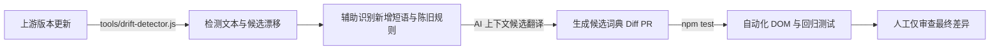

# Google Antigravity 中文汉化工具包 (Antigravity Chinese Toolkit)

<p align="center">
  <a href="https://github.com/yiheng8023/antigravity-chinese/actions/workflows/ci.yml"></a>
  <a href="https://github.com/yiheng8023/antigravity-chinese/releases/latest"></a>
  <a href="https://github.com/yiheng8023/antigravity-chinese/releases"></a>
  <a href="https://github.com/yiheng8023/antigravity-chinese/stargazers"></a>
  <a href="https://github.com/yiheng8023/antigravity-chinese/network/members"></a>
  
  
  <a href="LICENSE"></a>
</p>

<p align="center">
  <a href="README.md">简体中文</a> | <a href="README.en.md">English</a>
</p>

专为 **Google Antigravity 2.0** 桌面客户端（Windows / macOS / Linux）打造的高性能、可逆式中文本地化补丁与生命周期管理器（当前版本 **v3.3.3**，全面适配 Antigravity **v2.17.0** 升级）。

---

## 🌟 核心特性与设计哲学

- ⚡ **原生双模互补架构 (Dual-Mode Synergy Architecture)**：
  - **Mode 1（ASAR 深度持久化注入）**：通过 Electron ASAR 深度注入，实现系统托盘（`tray.js`）、主菜单（`menu.js`）、系统退出弹窗与界面 DOM 的 100% 原生全景汉化；
  - **Mode 2（零依赖 CDP 免解包热挂载）**：手搓 150 行原生 Node.js RFC 6455 协议客户端，免解包、0 磁盘修改、完全免疫上游静默更新覆写，随开随用。
- 🐧 **WSL 跨平台子系统全维适配 (WSL Cross-Platform Synergy)**：
  - 深度适配 Windows 客户端连接 WSL (Ubuntu 等) 运行环境全流程；
  - 原生支持应用菜单 `Connect to WSL`（连接到 WSL）/ `Reopen Locally`（在本地重新打开）；
  - 深度注入主进程 WSL 发行版缺失警告与跨系统 `/mnt` 路径性能告警弹窗，兼顾性能提示与无死角中文体验。
- 🧩 **2.17.0 复合 Alert 碎片化自愈与官方 10 大插件全景中文**：
  - 针对上游 2.17.0 全新 JSX 碎片化 Alert（如 `plan-command-fyi-alert`），通过复合节点探针实现手术刀级特异性自愈，避免全局单字歧义污染；
  - 彻底治愈新手引导 NUX 卡片（`Try 远程控制` ➔ `体验远程控制`、`Get Started` ➔ `开始体验`）及半中半英残留；
  - 全量出版级汉化官方 10 大插件（Android CLI, Chrome DevTools, Data Agent Kit, Gemini API, SDK 等）及其全景说明。
- 🏗️ **三层词库架构与自动化质量编译管线 (Three-Tier Compiler & Security Gates)**：
  - 词库源码彻底模块化分层：`dict/src/core/`（原子纯词条）、`dict/src/rules/`（级联规则）、`dict/src/ctx/`（特定上下文）；
  - 配备 **ASCII Key 阻断门禁**（物理杜绝中文残片混入 Key）、**捕获组守恒门禁**（语法编译与 `$1..$N` 严格对齐）、**重复 Key 冲突守卫**，编译生成单一发布包 `dist/zh-CN.bundle.json` 并平滑向后兼容。
- 🎯 **真理单源解耦与黄金语义真断言 (Single-Source Truth & Golden Snapshots)**：
  - 核心运行时抽离无状态计算工厂 `createI18nEngine`，全仓消灭一切测试与工具中的影子副本；
  - 全量 172 项真实 UI 文本采用 `assert.strictEqual` 黄金语义真断言（杜绝 `res !== tc` 假阳性），并引入 4 大类（思考时间、模型配额倒计时、动态模型插值、标点快捷键容差）不变性模糊测试 (Invariant Fuzzing)。
- **低开销高响应渲染架构 (High-Performance Runtime Architecture)**：阻断 `requestIdleCallback` 无序自旋；引入 DOM 否定标记缓存，未命中节点二次扫描 `O(1)` 极速短路；悬浮 Portal 门禁与 100ms 节流阀，确保长对话消息流与高频虚拟滚动下保持平滑流畅。
- **深层选项悬浮气泡与执行策略全量覆盖 (Option Tooltips & Delivery Strategies)**：全量收录排队消息策略悬浮气泡提示（`Queue until after the current turn.` ➔ `排队等待，直至当前轮次结束。`、`Interrupt the agent and send immediately.` ➔ `打断智能体并立即发送。`）以及终端自动执行、产物审查模式、严格模式等深层选项的动态说明。
- **行内纯文本容器联合自愈 (Multi-TextNode Coalescing Self-Healing)**：针对上游 React 模板碎片化拆分（如 `"All ", e, "s run as Flash."` 拆分为多个兄弟 TextNode 导致英文复数残片），在保持虚拟 DOM 节点引用稳定不报错的前提下，整句提纯联合自愈。
- **用户代码与终端严格保护**：智能跳过代码编辑区（`Monaco Editor` / `pre` / `code`）与终端控制台（`xterm`），确保代码逻辑与命令行指令的原样性。
- **两阶段原子回滚与冷启动断电自愈 (Two-Phase Staged Swap & Crash-Resilient Auto-Healing)**：注入采用安全暂存流转机制，失败自动回滚；若遭遇机器死机断电遗留孤儿暂存文件，CLI 启动入口自动识别并原子复原，杜绝客户端主文件丢失。
- **双重状态感知出厂基线与版本防回退 (Dual-State Baseline & Anti-Downgrade)**：首次注入时创建纯净备份；官方静默推送新版时自动刷新出厂基线，restore 还原时自动熔断拦截，彻底杜绝老旧备份覆盖官方新版导致的版本回退惨剧。
- **官方中文优雅让位 (Graceful Yield)**：内置 CJK 字符与官方语言环境自动探针，上游一旦上线官方中文自动主动让位，杜绝破坏。

---

## 📋 前置环境与要求 (Prerequisites)

在开始使用或安装汉化补丁前，请确保满足以下条件：

1. **操作系统支持**：
   - **Windows**：Windows 10 / 11 (x64)
   - **macOS**：macOS 12+（支持 Apple Silicon M系列及 Intel 芯片，首次注入自动处理 `codesign` 签名）
   - **Linux**：主流发行版（Ubuntu, Debian, Fedora, Arch 等 x64 / ARM64）
2. **Node.js 基础运行环境**：
   - 系统中需安装 **Node.js (>= 18.x)** 及附带的 **npm / npx** 工具（向下兼容 Node 18/20/22/24 等所有 LTS 版本）。
   - 验证方式：在终端运行 `node -v` 和 `npx -v`。若未安装，请前往 [Node.js 官方网站](https://nodejs.org/) 下载安装 LTS 版本。
3. **已安装 Antigravity 客户端**：
   - 确保本机已安装官方 **Google Antigravity 2.0** 桌面客户端。
4. **进程占用与文件锁守护**：
   - 安装器内置跨平台进程守护，执行安装时将自动检测并安全释放客户端文件锁。

---

## 🚀 快速开始

### 方式一：一键脚本（推荐日常使用）

#### Windows
- **安装汉化**：双击运行 [`install.bat`](install.bat)（自动执行前置健康预检、安全释放文件占用并一键双装客户端 UI 汉化 + 社区智能体插件）
- **自愈启动**：双击运行 [`launch.bat`](launch.bat)（自动检测版本覆盖并重新注入后启动）
- **恢复英文**：双击运行 [`uninstall.bat`](uninstall.bat)

#### macOS / Linux
- **安装汉化**：在终端运行 `./install.sh`
- **恢复英文**：在终端运行 `./uninstall.sh`

---

### 方式二：CLI 命令行管理器

```bash
# 1. 查看当前客户端及汉化状态
node cli.js status

# 2. 执行前置环境全维健康预检 (Node 弹性版本、NPX 工具、客户端路径与进程锁)
node cli.js check

# 3. 一键安装汉化（自动备份并注入）
node cli.js install

# 4. 安装 Antigravity 官方中文智能体插件
node cli.js install-plugin

# 5. 自愈启动（自动检测版本覆盖并重新注入后拉起客户端）
node cli.js launch

# 6. 后台守护模式（监听官方更新并自动完成重新汉化）
node cli.js watch

# 7. 一键还原回官方英文原版
node cli.js restore

# 8. 指定自定义客户端路径安装
node cli.js install --path "你的 Antigravity 安装目录或 app.asar 路径"
```

---

## 🧪 自动化测试与质量保证 (Testing & Verification)

本项目引入极其严苛的端到端自动化回归测试与跨平台 CI 矩阵（Windows / macOS / Ubuntu x Node 18/20），避免人工经验验证带来的遗漏：

```bash
# 运行全套自动化测试（聚合 8 大全真测试套件，共 320+ 项真理断言）
npm test
```

- **词库格式与语法排毒 (`test/test-lint.js`)**：检测词库 JSON 格式合规性与基础语法健康度。
- **核心 DOM 注入与性能短路断言 (`test/verify.js`)**：使用 JSDOM 模拟真实渲染环境，包含 115 项断言，验证关键 DOM 路径翻译准确性、Monaco Editor 与终端保护、零卡顿 DOM 否定标记短路与悬浮 Portal 门禁阈值。
- **真理单源黄金语义断言与不变性模糊测试 (`test/test-screenshots.js`)**：全仓废除影子复刻，直连核心 `createI18nEngine` 计算工厂，覆盖 159 项真实 UI 截图 `assert.strictEqual` 黄金语义真断言，外加 4 大类（思考时间 7 组、模型配额倒计时 7 组、动态模型插值 3 组、标点快捷键 3 组）不变性模糊测试 (Invariant Fuzzing)。
- **零依赖 RFC 6455 协议层双向握手与通信断言 (`test/test-cdp.js`)**：基于原生 Node.js 内置模块测试 RFC 6455 WebSocket 握手认证、数据帧编解码、JSON-RPC 往返通信及优雅挥手关闭。
- **菜单、托盘与自杀防御门禁 (`test/test-menu-and-titles.js`)**：严格确保单字词不误伤会话标题、主进程系统托盘协同注入与原生退出确认弹窗安全，并在智能体会话（`ANTIGRAVITY_AGENT=1` 或 `AGY_NO_KILL=1`）下触发自杀防御门禁（拦截强杀宿主进程）。
- **ASAR 全真生命周期与防降级演进测试 (`test/test-asar-lifecycle.js`)**：真实打包生成 ASAR 二进制包，包含 31 项全真断言，验证解包、注入、二次安装幂等、官方静默推送防降级熔断、两阶段原子回滚以及冷启动断电崩溃自愈。
- **真实宿主无参路径探测实测 (`test/test-detector-live.js`)**：在真实 Ubuntu / macOS / Windows runner 上验证 0 参数自动路径探测。
- **出版级与学术级词库质检 (`test/test-proofread-integrity.js`)**：11 项断言全量扫描 1,928 条词条与 223 组级联正则，保障 0 错别字（登录/账号/其他/按钮等）、全角标点排版规范、CCF 核心计算机学术术语及正则表达式编译安全。

---

## 🔄 自动化演进：从“维护汉化”到“自我演化本地化系统”

面对 Antigravity 频繁的版本迭代，本项目演进的核心方向是**逐步建立能够自动跟随上游演化的工程闭环**：



* **科学三层分级指标**：通过 `npm run scan:drift` 输出【观察到的候选总数】、【精确匹配覆盖率】与【综合规则有效翻译覆盖率 (Rule-Assisted)】。
* **陈旧规则辅助排查**：反向检测当前词典中在新版本中未被观测到的历史词条（`exactKeys - observed`），为清理失效或被上游重构的词条提供线索。
* **逐步降低维护成本**：将原本繁琐的全量人肉核对，转变为由脚本提取差异、由 CI 自动化回归测试、维护者仅需对关键术语进行审查与确认的协作模式。

---

## 🔌 双模生态：Antigravity 社区智能体插件 (Community Plugin Suite)

除了作为客户端宿主 UI 汉化补丁运行外，本项目还内置了完全符合 Antigravity 插件规范的**全栈中文智能体增强插件**（插件注册 ID：`antigravity-chinese-toolkit`，仓库源码位于 [`plugins/chinese-toolkit/`](plugins/chinese-toolkit/)）：

### 插件功能特性
- **中文交互与工程规则 (`rules/chinese-interaction-rules.md`)**：规范智能体全流程简体中文思考、代码中文注释及严格的技术术语保留准则。
- **本地化诊断技能 (`skills/i18n-diagnostics/`)**：为智能体赋能一键状态诊断、版本漂移分析（`scan:drift`）与自动化测试能力。

### 启用插件方式
- **全局一键安装（推荐）**：运行 `node cli.js install-plugin`（执行 `install.bat` 时也会默认同步静默安装）
- **手动启用**：将 `plugins/chinese-toolkit` 目录复制至本地全局插件目录：
  - Windows: `%USERPROFILE%\.gemini\config\plugins\chinese-toolkit`
  - macOS / Linux: `~/.gemini/config/plugins/chinese-toolkit`
  - *注：Antigravity 识别插件注册名为 `plugin.json` 中的 `name` 字段（`antigravity-chinese-toolkit`），安装目录文件夹可为 `chinese-toolkit`。*

---

## 📁 仓库结构 (Repository Structure)

```text
antigravity-chinese/
├── .github/
│   └── workflows/
│       └── ci.yml                    # 全平台 CI 自动化测试流水线 (Ubuntu/macOS/Windows)
├── dict/                             # 汉化词库与分层源码
│   ├── src/                          # 三层分层词库源码
│   │   ├── core/                     # 原子纯词条 (common.json)
│   │   ├── rules/                    # 动态级联正则表达式 (patterns.json)
│   │   └── ctx/                      # 特定上下文 (permissions.json, settings.json)
│   └── zh-CN.json                    # 核心汉化词库 (2,027 精确词条 + 231 组级联正则，兼容同步)
├── dist/                             # 自动化构建编译产物
│   └── zh-CN.bundle.json             # 三层编译整合单一发布包
├── core/                             # 核心引擎与双模驱动
│   ├── i18n-runtime.js               # 零卡顿前端注入引擎 (DOM 否定标记、悬浮门禁节流、createI18nEngine 纯工厂)
│   └── cdp-client.js                 # 零依赖 RFC 6455 CDP WebSocket 客户端 (免解包热挂载协议层)
├── plugins/
│   └── chinese-toolkit/              # Antigravity 官方中文智能体增强插件
│       ├── rules/                    # 智能体中文交互规则 (chinese-interaction-rules.md)
│       ├── skills/                   # 本地化诊断技能 (i18n-diagnostics)
│       └── plugin.json               # 插件规范清单配置文件
├── test/                             # 自动化全真回归测试套件 (8 大套件 340+ 断言)
│   ├── test-lint.js                  # 词库格式与语法排毒校验
│   ├── verify.js                     # 115 项 JSDOM 状态机与运行时性能断言
│   ├── test-screenshots.js          # 172 项 strictEqual 黄金语义真断言 + 20 项不变性模糊测试
│   ├── test-cdp.js                   # 零依赖 RFC 6455 CDP 协议层双向通信测试
│   ├── test-menu-and-titles.js       # 菜单项、托盘协同与自杀防御门禁断言
│   ├── test-asar-lifecycle.js        # 31 项 ASAR 生命周期、两阶段原子回滚与冷启动自愈断言
│   ├── test-detector-live.js         # 真实宿主系统 0 参数无参安装路径探测断言
│   └── test-proofread-integrity.js   # 出版级错别字、全角标点、学术术语与正则安全质检
├── tools/                            # 自动化编译、逆向与漂移检测工具链
│   ├── build-dict.js                 # 三层词典构建编译器 (ASCII Key 阻断、捕获组守恒门禁)
│   ├── drift-detector.js             # 上游版本文本与候选漂移检测器 (npm run scan:drift)
│   ├── build-full-dict.js            # 全量词典自动化去重与辅助工具
│   └── gap-analysis.js               # 覆盖率差量与漏项自动化分析器
├── docs/assets/sponsoring/           # 赞助与社区资产
├── cli.js                            # 跨平台生命周期管理 CLI (探测、备份、解包、注入、打包、防降级还原)
├── install.bat / install.sh          # 一键安装脚本 (默认双装 UI 补丁 + 官方插件)
├── launch.bat                        # 自愈启动脚本 (秒级自愈检测并拉起客户端)
├── uninstall.bat / uninstall.sh      # 一键还原脚本 (安全防降级出厂复原)
├── package.json                      # 项目配置与 npm scripts
├── LICENSE                           # MIT 开源许可证
└── README.md / README.en.md          # 中英双语说明文档
```

---

## 💖 自愿赞助与支持

如果 Antigravity 中文汉化项目对你的开发工作有所帮助，并且你愿意支持本项目的持续维护、文档优化、自动化测试与版本迭代，诚挚感谢任意金额的自愿赞助。赞助完全自愿，不构成任何服务级承诺。

- **人民币赞助**：可扫描下方微信支付或支付宝收款码。
- **跨境赞助 / 其他币种**：可以使用 **[PayPal 赞助链接](https://www.paypal.com/ncp/payment/LNTF8KXGJXMZY)**。实际可用币种、付款方式与换汇以 PayPal 结算页为准。

付款前请核对结算页面显示的收款方。感谢你对开源项目的认可与支持！

<table>
  <tr>
    <td align="center"><strong>微信支付（人民币）</strong><br></td>
    <td align="center"><strong>支付宝（人民币）</strong><br></td>
  </tr>
</table>

---

## 👥 贡献者墙 (Contributors)

诚挚感谢所有为本项目贡献代码、反馈 Bug、完善词库与文档的开发者们！

<p align="center">
  <a href="https://github.com/yiheng8023/antigravity-chinese/graphs/contributors">
    
  </a>
</p>

---

## 📈 Star 增长趋势与社区生态 (Star History)

[](https://star-history.com/#yiheng8023/antigravity-chinese&Date)

---

## ⚠️ 免责声明与合规说明 (Disclaimer & Compliance)

1. **非官方项目**：本项目为社区发起的开源本地化辅助工具，**非 Google 官方产品**，与 Google LLC 及其关联公司无官方从属或背书关系。
2. **商标声明**：`Google`, `Google Antigravity`, `Gemini`, `Chrome` 等相关商标、产品名称及版权均归其各自所有者所有。
3. **合法使用**：本项目仅供个人学习、技术研究及中文本地化辅助使用。本项目**绝不分发**任何官方专有二进制资产（如 `app.asar` 或源码文件），所有修改均在用户本地客户端合法完成。
4. **安全与隐私**：本项目**绝不包含**任何形式的遥测上报、网络后门或用户凭据读取逻辑。代码 100% 开源透明。

---

## 📄 开源许可证

本项目基于 [MIT License](LICENSE) 协议开源。
