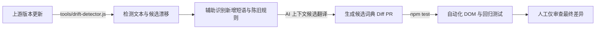

# Google Antigravity 中文汉化工具包 (Antigravity Chinese Toolkit)

<p align="center">
  <a href="https://github.com/yiheng8023/antigravity-chinese/actions/workflows/ci.yml"></a>
  <a href="https://github.com/yiheng8023/antigravity-chinese/releases/latest"></a>
  
  
  <a href="LICENSE"></a>
</p>

<p align="center">
  <a href="README.md">简体中文</a> | <a href="README.en.md">English</a>
</p>

专为 **Google Antigravity 2.0** 桌面客户端（Windows / macOS / Linux）打造的高性能、可逆式中文本地化补丁与生命周期管理器。

---

## 🌟 核心特性与设计哲学

- **可逆式运行时注入 (Reversible Runtime Engine)**：通过 Electron `preload` 阶段挂载响应式 DOM 翻译引擎，兼顾轻量与深度本地化。
- **预加载同步挂载 (Preload Hook)**：在渲染进程初始化阶段尽早介入，最大程度减少英文向中文的界面跳变。
- **用户代码与终端严格保护**：智能跳过代码编辑区（`Monaco Editor` / `pre` / `code`）与终端控制台（`xterm`），确保代码逻辑与命令行指令的原样性。
- **自愈启动与文件守护 (Self-Healing & Watcher)**：提供自愈启动器（`launch.bat`）与文件监听守护机制，上游更新覆盖后可自动检测并重新注入。
- **复合段落智能拆分 (Multi-Sentence Parsing)**：自动拆解多句子复合段落，支持动态时间与配额百分比的级联正则替换。
- **版本化指纹基线备份与可逆还原**：首次注入时自动创建 `app.asar.bak` 原生备份，上游版本更新自动刷新纯净基线，随时可一键还原至官方纯英文初始状态。
- **官方中文优雅让位 (Graceful Yield)**：内置 CJK 字符与官方语言环境自动探针，上游一旦上线官方中文自动主动让位，杜绝破坏。

---

## 📋 前置环境与要求 (Prerequisites)

在开始使用或安装汉化补丁前，请确保满足以下条件：

1. **操作系统支持**：
   - **Windows**：Windows 10 / 11 (x64)
   - **macOS**：macOS 12+（支持 Apple Silicon M系列及 Intel 芯片，首次注入自动处理 `codesign` 签名）
   - **Linux**：主流发行版（Ubuntu, Debian, Fedora, Arch 等 x64 / ARM64）
2. **Node.js 基础运行环境**：
   - 系统中需安装 **Node.js (>= 16.x)** 及附带的 **npm / npx** 工具（向下完全兼容 Node 18/20/22/24 等所有更高版本）。
   - 验证方式：在终端运行 `node -v` 和 `npx -v`。若未安装，请前往 [Node.js 官方网站](https://nodejs.org/) 下载安装 LTS 版本。
3. **已安装 Antigravity 客户端**：
   - 确保本机已安装官方 **Google Antigravity 2.0** 桌面客户端。
4. **进程占用与文件锁守护**：
   - 安装器内置跨平台进程守护，执行安装时将自动检测并安全释放客户端文件锁。

---

## 🚀 快速开始

### 方式一：一键脚本（推荐日常使用）

#### Windows
- **安装汉化**：双击运行 [`install.bat`](file:///C:/Projects/antigravity-chinese/install.bat)（自动执行前置健康预检、安全释放文件占用并一键双装客户端 UI 汉化 + 官方智能体插件）
- **自愈启动**：双击运行 [`launch.bat`](file:///C:/Projects/antigravity-chinese/launch.bat)（自动检测版本覆盖并重新注入后启动）
- **恢复英文**：双击运行 [`uninstall.bat`](file:///C:/Projects/antigravity-chinese/uninstall.bat)

#### macOS / Linux
- **安装汉化**：在终端运行 `./install.sh`
- **恢复英文**：在终端运行 `./uninstall.sh`

---

### 方式二：CLI 命令行管理器

```bash
# 1. 查看当前客户端及汉化状态
node cli.js status

# 2. 执行前置环境全维健康预检 (Node 弹性版本、NPX 工具、客户端路径与进程锁)
node cli.js check

# 3. 一键安装汉化（自动备份并注入）
node cli.js install

# 4. 安装 Antigravity 官方中文智能体插件
node cli.js install-plugin

# 5. 自愈启动（自动检测版本覆盖并重新注入后拉起客户端）
node cli.js launch

# 6. 后台守护模式（监听官方更新并自动完成重新汉化）
node cli.js watch

# 7. 一键还原回官方英文原版
node cli.js restore

# 8. 指定自定义客户端路径安装
node cli.js install --path "你的 Antigravity 安装目录或 app.asar 路径"
```

---

## 🧪 自动化测试与质量保证 (Testing & Verification)

本项目引入严格的端到端自动化回归测试与跨平台 CI 矩阵（Windows / macOS / Ubuntu x Node 18/20），避免人工经验验证带来的遗漏：

```bash
# 运行全套自动化测试（包含 6 大全真测试套件，共 145+ 项断言）
npm test
```

- **核心 DOM 注入与代码保护 (`test/verify.js`)**：使用 JSDOM 模拟真实渲染环境，验证 50 项关键 DOM 路径的翻译准确性、Monaco Editor 保护及跨平台路径解析。
- **真实截图用例集 (`test/test-screenshots.js`)**：覆盖 64 项来自真实界面截图的复合句子、动态限额与时间解析。
- **菜单与会话标题防误伤 (`test/test-menu-and-titles.js`)**：确保单字词不破坏用户自定义会话名称。
- **ASAR 全真生命周期测试 (`test/test-asar-lifecycle.js`)**：真实打包生成 ASAR 二进制包，验证解包、注入、签名校验与出厂原子回滚。
- **真实宿主无参路径探测实测 (`test/test-detector-live.js`)**：在真实 Ubuntu / macOS / Windows runner 上验证 0 参数自动路径探测。
- **出版级与学术级词库质检 (`test/test-proofread-integrity.js`)**：11 项断言自动扫描 0 错别字（登录/账号/其他等）、全角标点排版、CCF 核心学术术语与正则安全。

---

## 🔄 自动化演进：从“维护汉化”到“自我演化本地化系统”

面对 Antigravity 频繁的版本迭代，本项目演进的核心方向是**逐步建立能够自动跟随上游演化的工程闭环**：



* **科学三层分级指标**：通过 `npm run scan:drift` 输出【观察到的候选总数】、【精确匹配覆盖率】与【综合规则有效翻译覆盖率 (Rule-Assisted)】。
* **陈旧规则辅助排查**：反向检测当前词典中在新版本中未被观测到的历史词条（`exactKeys - observed`），为清理失效或被上游重构的词条提供线索。
* **逐步降低维护成本**：将原本繁琐的全量人肉核对，转变为由脚本提取差异、由 CI 自动化回归测试、维护者仅需对关键术语进行审查与确认的协作模式。

---

## 🔌 双模生态：Antigravity 官方插件形态 (Plugin Suite)

除了作为客户端宿主 UI 汉化补丁运行外，本项目还内置了完全符合 Antigravity 官方规范的**全栈中文智能体增强插件**（位于 [`plugins/chinese-toolkit/`](file:///C:/Projects/antigravity-chinese/plugins/chinese-toolkit/)）：

### 插件功能特性
- **中文交互与工程规则 (`rules/chinese-interaction-rules.md`)**：规范智能体全流程简体中文思考、代码中文注释及严格的技术术语保留准则。
- **本地化诊断技能 (`skills/i18n-diagnostics/`)**：为智能体赋能一键状态诊断、版本漂移分析（`scan:drift`）与自动化测试能力。

### 启用插件方式
- **全局一键安装（推荐）**：运行 `node cli.js install-plugin`
- **手动启用**：将 `plugins/chinese-toolkit` 目录复制至本地全局插件目录：
  - Windows: `%USERPROFILE%\.gemini\config\plugins\chinese-toolkit`
  - macOS / Linux: `~/.gemini/config/plugins/chinese-toolkit`

---

## 📁 仓库结构

```text
antigravity-chinese/
├── dict/
│   └── zh-CN.json            # 汉化词典库（1070+ 精确词条 + 25 组级联正则）
├── core/
│   └── i18n-runtime.js       # 前端运行时注入引擎（Preload 挂载、防抖、代码区保护、优雅让位）
├── plugins/
│   └── chinese-toolkit/      # Antigravity 官方智能体插件（中文规则 Rules + 诊断技能 Skills）
├── cli.js                    # 跨平台管理工具（Buffer 签名探测、解包、注入、打包、还原、自愈启动）
├── install.bat / install.sh  # 一键安装脚本（默认双装 UI 补丁 + 官方插件）
├── launch.bat                # 自愈启动脚本
├── uninstall.bat / uninstall.sh # 一键还原脚本
├── test/                     # 自动化全真回归测试套件（DOM 模拟、截图用例、ASAR 生命周期、无参探测）
├── tools/                    # 文本提取、差量比对与漂移检测工具链
├── docs/assets/sponsoring/   # 赞助与支持相关资产
├── package.json              # 项目配置
├── LICENSE                   # MIT 开源许可证
└── README.md                 # 说明文档
```

---

## 💖 自愿赞助与支持

如果 Antigravity 中文汉化项目对你的开发工作有所帮助，并且你愿意支持本项目的持续维护、文档优化、自动化测试与版本迭代，诚挚感谢任意金额的自愿赞助。赞助完全自愿，不构成任何服务级承诺。

- **人民币赞助**：可扫描下方微信支付或支付宝收款码。
- **跨境赞助 / 其他币种**：可以使用 **[PayPal 赞助链接](https://www.paypal.com/ncp/payment/LNTF8KXGJXMZY)**。实际可用币种、付款方式与换汇以 PayPal 结算页为准。

付款前请核对结算页面显示的收款方。感谢你对开源项目的认可与支持！

<table>
  <tr>
    <td align="center"><strong>微信支付（人民币）</strong><br></td>
    <td align="center"><strong>支付宝（人民币）</strong><br></td>
  </tr>
</table>

---

## ⚠️ 免责声明与合规说明 (Disclaimer & Compliance)

1. **非官方项目**：本项目为社区发起的开源本地化辅助工具，**非 Google 官方产品**，与 Google LLC 及其关联公司无官方从属或背书关系。
2. **商标声明**：`Google`, `Google Antigravity`, `Gemini`, `Chrome` 等相关商标、产品名称及版权均归其各自所有者所有。
3. **合法使用**：本项目仅供个人学习、技术研究及中文本地化辅助使用。本项目**绝不分发**任何官方专有二进制资产（如 `app.asar` 或源码文件），所有修改均在用户本地客户端合法完成。
4. **安全与隐私**：本项目**绝不包含**任何形式的遥测上报、网络后门或用户凭据读取逻辑。代码 100% 开源透明。

---

## 📄 开源许可证

本项目基于 [MIT License](LICENSE) 协议开源。
